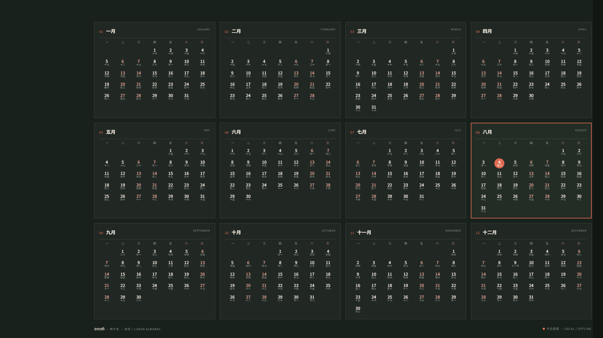

# 月序 / Lunar Almanac

<p align="center">
  
</p>

> 一张每天自动更新的全年农历桌面日历。更新与设置都由 Rust 原生程序完成，没有常驻服务、浏览器、WebView 或网络连接。



[查看浅色主题预览](assets/preview-light.png)

## 产品状态

- Windows 10/11 x64
- 全年 12 个月、农历、闰月、当天高亮
- 深色、浅色、月海、松烟、朱砂、雾蓝六套内置主题与可导入的自定义主题，默认深色，主题会被本地记住
- 登录和每天 `00:01` 自动更新；错过零点会在系统恢复后补跑
- 默认按当前主屏的物理分辨率生成壁纸，避免不必要的 4K 渲染、缩放和裁切
- 用户级安装，不要求管理员权限
- 常规更新使用 Rust + `lunar_rust` + `resvg` + `tiny-skia`，不依赖 Chrome、Edge 或 WebView
- 原生 Windows 设置窗口：日历预览、主题、实时配色、上下左右边距、导入和导出都在同一个桌面窗口完成

双击桌面或开始菜单的“月序日历”会打开原生设置窗口。它只在用户主动打开时运行；计划任务和每日壁纸更新不会创建任何窗口。

## 安装

从 Release 下载 `YueXu-<版本>-windows-x64.zip`，解压后在 PowerShell 运行：

当前开源发行包未进行代码签名。下载后请先核对 Release 附带的 SHA256 校验文件；首次运行时如出现 Windows SmartScreen 提示，请按所在组织的安全策略处理。

```powershell
Set-ExecutionPolicy -Scope Process Bypass
.\Install-YueXu.ps1
```

安装完成后，桌面和开始菜单会出现“月序日历”。打开它可以预览全年日历、切换六套内置主题、编辑 11 项颜色、调整上下左右边距、导入/导出主题。调色和拖动边距会即时刷新预览；只有点击“应用到桌面”才会保存设置并更新桌面。升级安装默认保留已有主题，首次安装回落到深色。

## 命令行

```powershell
# 立即更新，使用记住的主题
Start-Process -FilePath .\LunarCalendar.exe -ArgumentList @('--update', '--quiet') -Wait

# 切换并记住浅色主题
Start-Process -FilePath .\LunarCalendar.exe -ArgumentList @('--update', '--theme', 'light') -Wait

# 切换并记住月海主题
Start-Process -FilePath .\LunarCalendar.exe -ArgumentList @('--update', '--theme', 'moonlit') -Wait

# 导出当前主题作为 JSON 模板，编辑后导入并应用
Start-Process -FilePath .\LunarCalendar.exe -ArgumentList @('--export-theme', '.\my-theme.json') -Wait
Start-Process -FilePath .\LunarCalendar.exe -ArgumentList @('--theme-file', '.\my-theme.json') -Wait

# 生成图片但不设置为壁纸
Start-Process -FilePath .\LunarCalendar.exe -ArgumentList @('--update', '--width', '1920', '--height', '1080', '--set-wallpaper=false') -Wait

# 打开预览与设置
Start-Process -FilePath .\LunarCalendar.exe -ArgumentList @('--preview')
```

`LunarCalendar.exe` 是 GUI 子系统程序。手工打开设置窗口无需等待；在脚本里调用更新、导入或导出时应保留 `-Wait`，以确保下一步在操作完成后再执行。

生成的壁纸与偏好只写入 `%LOCALAPPDATA%\YueXu`。不读取日历账户、不上传数据、不需要 API Key。

自定义主题文件中的每个颜色都必须是 `#RRGGBB`。上下左右边距作为本机版式偏好保存在 `%LOCALAPPDATA%\YueXu\settings.json`，不会写入主题文件。仓库内提供 [themes/moonlit-ink.json](themes/moonlit-ink.json) 作为可直接导入的样例；导入后，登录与每日更新会沿用该主题。

## 架构

| 层 | 实现 |
| --- | --- |
| 日历与农历 | Rust，`lunar_rust` 离线历法 |
| 版式与 PNG | Rust 生成 SVG，`resvg` / `tiny-skia` 进程内栅格化 |
| Windows 集成 | 原生 Win32 `SystemParametersInfoW` 设置壁纸、Windows 任务计划程序定时触发 |
| 预览设置 | 仅按需打开的 Win32 原生设置窗口，使用与壁纸相同的渲染器 |

## 面向商业发行

这个仓库提供可复现的 Windows 发行构建，而不是只提供开发脚本：

```powershell
.\scripts\Build-Release.ps1
```

构建会生成 GUI 子系统的 `LunarCalendar.exe`、安装器、卸载器、ICO 图标、SHA256 校验和和版本化 zip。发布与定价策略见 [docs/商业化方案.md](docs/商业化方案.md)，正式发布前检查 [docs/发布清单.md](docs/发布清单.md)。

## 开发

```powershell
cargo test --locked
cargo run -- --update --width 1920 --height 1080 --set-wallpaper=false
```

Rust 运行时代码在 `native/`；其中 `native/ui.rs` 是原生设置窗口，`native/calendar.rs` 同时驱动窗口预览和实际壁纸生成。

## 开源

月序以 MIT License 开源。开源版可以自由使用、修改和分发；商业发行可提供签名安装包、专属主题包、批量部署和优先支持。贡献方式见 [CONTRIBUTING.md](CONTRIBUTING.md)。
